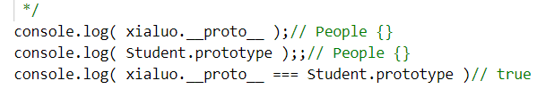

 

#原型
##原型关系
    每个 class都有显示原型 prototype
    每个实例都有隐式原型 __proto__
    实例的__proto__，指向对应class的prototype
 

##基于原型的执行规则
    获取熟悉 xialuo.name 或执行方法 xialuo.sayhi()时，
    先在自身属性和方法寻找
    找不到，则自动去隐式原型__proto__中查找

#原型链
 
 
实例的__proto__指向对应类的prototype
xialuo是Student的实例，xialuo的__proto__指向Student的prototype
Student是People的子类，Student的__proto__指向People的prototype 
当访问 xialuo.sayHi()时,因为本身没有,则通过__proto__隐式原型向上寻找,在Student中找到
当访问 xialuo.eat()时,Student中没找到，则继续向上，在People中找到，故称原型 链
即：在每一级都会访问当前的属性，如果没有就向上寻找隐式原型__proto__
 
hasOwnProperty(''); //判断是否是自身所拥有的属性
 
 
people继承于object，people的__proto__指向Object的prototype
当xialuo访问hasOwnProperty()方法时，就是一层一层的向上找到Object里面的
Object是否还能向上找呢？不能
Object的__proto__为null

#instanceof
 
xialuo 的__proto__一层层的向上走，能不能与该层对应的class的prototype对应上，对应上返回true，否则返回false

#重要提示
 