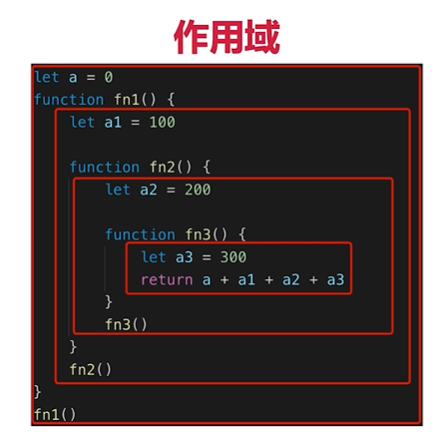

#题目
##this的不同应用场景，如何取值？
    当作普通函数被调用，返回window
    使用call apply bind 传入什么绑定什么
    作为对象方法调用，返回对象本身
    在class的方法中调用，返回当前实例的本身
    箭头函数，找上级作用域的this的值来确定
     
##手写bind函数
##实际开发中闭包的应用场景，举例说明
##创建10个<a>标签，点击的时候弹出来对应的序号

#知识点
##作用域和自由变量
##闭包
##this

 

#作用域
##全局作用域
##函数作用域
##块级作用域(ES6新增)

#自由变量
##一个变量在当前作用域没有定义，但是被使用了
##向上级作用域，一层一层依次寻找，直到找到为止
##如果到全局作用域都没找到，则报错 xx is not defined

#闭包： 闭包是函数本身和该函数声明时所处的环境状态的组合，函数能够"记忆住"其定义时所处的环境，即函数不在其定义的环境中被调用，也能访问定义时所处环境的变量
##具有记忆性，模拟私有变量
##作用域应用的特殊情况，有两种表现：
##函数作为参数被传递
##函数作为返回值被返回

#this
(this在各个场景中取什么样的值，是在函数执行的时候确认的
不是在定义的时候确定的)
##在class方法中调用
##箭头函数
##
##
##
##
##
