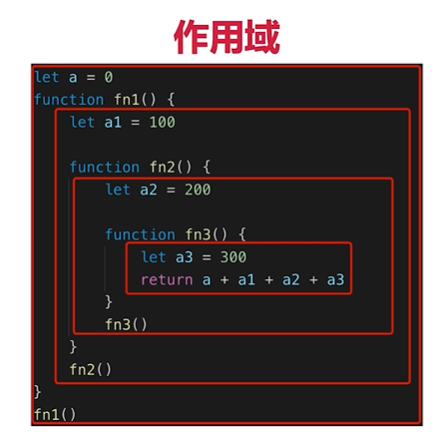

#题目
##this的不同应用场景，如何取值？
##手写bind函数
##实际开发中闭包的应用场景，举例说明
##创建10个<a>标签，点击的时候弹出来对应的序号

#知识点
##作用域和自由变量
##闭包
##this

 

#作用域
##全局作用域
##函数作用域
##块级作用域(ES6新增)

#自由变量
##一个变量在当前作用域没有定义，但是被使用了
##向上级作用域，一层一层依次寻找，直到找到为止
##如果到全局作用域都没找到，则报错 xx is not defined

#闭包
##作用域应用的特殊情况，有两种表现：
##函数作为参数被传递
##函数作为返回值被返回
##
##
##
##
##
##
##
##
